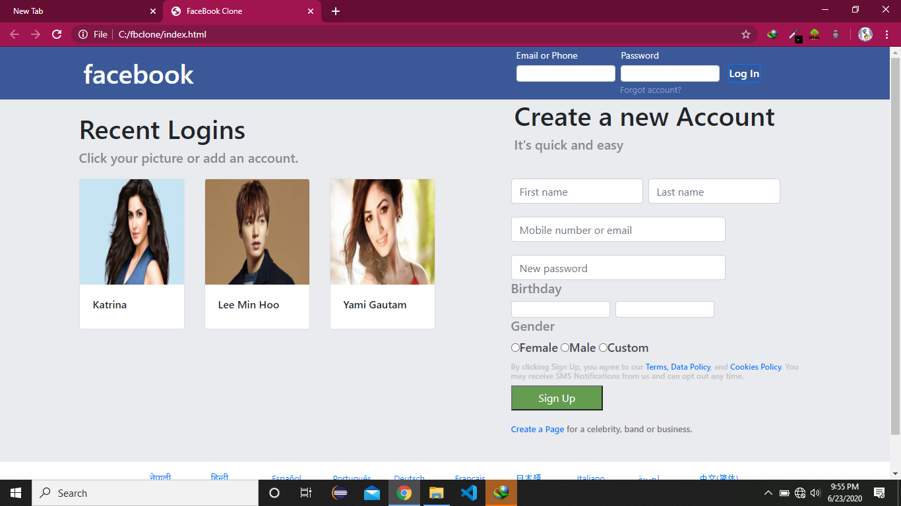

# FbClonePartOne with Nodejs And MongoDb
> Web application built using html/css as a front end along with Nodejs and mongodb as backend wiht authoriaztion

# Application Screenshots

# Tools used

* BootStrap

* Nodejs

* MongoDB

> ©️ Santosh Thapa

